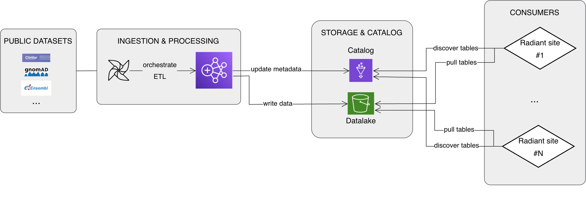

# Chosen Public Datalake Architecture: Airflow, EMR, Glue, Iceberg

* Status: proposed
* Deciders: @kritchie (Karl Richie), @laurabegin (Laura Bégin), @celinepelletier (Céline Pelletier), @jecos (Jeremy Costanza), @LysianeBouchard (Lysiane Bouchard)

Technical Story: https://d3b.atlassian.net/browse/SJRA-1091

## Context and Problem Statement

The Public Datalake project aims to centralize and automate the ingestion, management, and versioning of public third-party datasets (e.g., ClinVar, Ensembl, gnomAD) for Radiant. To guide early planning and discussions, we need to document a hypothetical architecture.

The following diagram provides a high-level overview of the envisioned architecture:

Main question:
Which tools should we use to address our main needs—such as orchestration, data processing and versioning?

## Decision Drivers 

- AWS compatibility:
    The data lake will be deployed in an AWS environment
- Integration with StarRocks:
    Data must be accessible as an external catalog in StarRocks (Radiant)
- Stability and maturity:
    Preference for proven, well-supported technologies
- Scalability:
    Some public datasets are very large and require scalable processing and storage
- Team expertise:
    Leverage existing knowledge and experience within the team

## Considered Options

Here are the options we considered for each architectural component:

* **Orchestration:** airflow
* **Data processing:** EMR, polars
* **Catalog:** Polaris, Lakekeeper, Nessie, Glue
* **Data Format:** iceberg

## Decision Outcome

**Chosen architecture:** Airflow + EMR + Glue + Iceberg

**Airflow:**
Airflow was selected without considering alternatives, due to its proven orchestration capabilities and strong team expertise.

**EMR:**
EMR was chosen for its scalability, maturity, and easy integration with AWS. Compared to Polars, EMR is better suited for large-scale, distributed data processing and offers robust support for our chosen data format, Iceberg. Polars, being single-node and less mature, may not scale effectively for very large datasets and lacks convenient functions for reading and writing Iceberg tables.

**Glue:**
Glue was selected as the metadata and catalog solution because it is mature, fully supports the Iceberg REST API (including table versioning and management), and integrates well with StarRocks.  Polaris and Lakekeeper did not offer significant advantages, were harder to deploy in AWS and lacked team experience. Nessie was specifically excluded because Dremio is discontinuing maintenance in favor of Polaris.

**Iceberg:**
Iceberg was chosen as the data format for consistency with Radiant, compatibility with Spark and other analytics tools, and—most importantly—its robust built-in support for versioned tables, which is a key requirement for the project.
